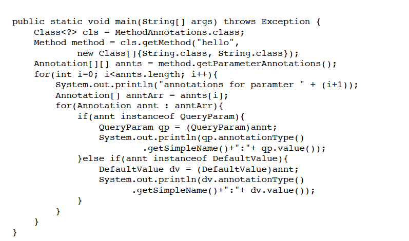

# 注解

## 1. 概念
在Java中，注解就是给元素添加一些信息，用字符@开头，这些信息用于修饰它后面紧挨着的其他代码元素，比如类、接口、方法、属性（字段）、方法中的参数、构造方法等。可以被编译器、程序运行时和其他根据使用，用于增强或修改程序行为等。

## 2. 分类
> 1. 内置注解：例如：@Override、@Deprecated、@SuppressWarnings
> 2. 自定义注解：包括第三方框架和库的注解，以及项目中自行定义的一些注解

## 3. 使用注解（自定义注解）

### 3.1 从已有注解中学习（@Override）

```java

@Target(ElementType.METHOD)
@Retention(RetentionPolicy.SOURCE)
public @interface Override {
    // 这里是自己添加的，是为了说明注解定义时可以有参数
    boolean optional() default false;
}

```

> **说明**
> 
> 1. 定义注解和定义接口有点类似，都是用 `interface` ，不过注解的`interface` 签名多了个@符号
> 
> 2. `@Target` 和 `@Retention` 这两个注解专门用于定义注解本身
> 
> 3. `@Target` 表示注解的目标。`ElementType.METHOD` 表示目标是方法，`ElementType` 是一个枚举类，还有 `TYPE` (表示类或者接口)、 `LOCAL_VARIABLE`(本地变量)、`MODULE`(模块) 等等，目标可以有多个，用`{}`表示，例如：`@Target({TYPE, FIELD, METHOD, PARAMETER, CONSTRUCTOR, LOCAL_VARIABLE})`。**如果没有声明`@Target`，默认为适用于所有类型**
> 
> 4. `@Retention` 表示注解信息保留到什么时候，取值只能有一个，类型为`RetentionPolicy`，它是一个枚举类型，取值有三个
> - `SOURCE`: 只在源代码中保留，编译器将代码编译为字节码文件后就会丢掉
> 
> - `CLASS`: 保留到字节码文件中，但Java虚拟机将class文件加载到内存时不一定会在内存中保留
> 
> - `RUNTIME`: 一直保留到运行时
> 
> - **注：如果没有声明@Retention，则默认为CLASS。**
> 
> 5. 定义注解可以有参数，如果只有一个参数，则在使用时可以不填写参数名称（例如上面的`optional`）
> 
> **注意**
> - **注解不能继承，但是如果定义注解（假如是A）时使用了 `@Inherited` 元注解进行定义，则使用该注解（是指A）的类（假如是B）的子类（假如是C）可以继承该注解（A）。（C就从B继承了A注解）**
> 

### 3.2 使用注解

> **思路**
> 
> 通过反射从类中获取方法，然后获取对应的属性和注解，如下图
> 


 